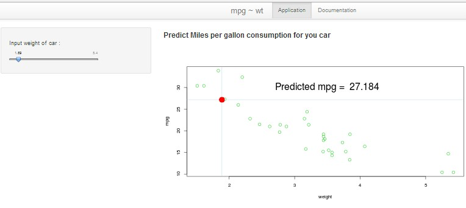

## Slide 2. 

### Mpg ~ Wt. About application

1. **Mpg ~ Wt**  is a simple web application. It's based on **shiny**  a web application framework for R.

2. **Mpg ~ Wt** predicts Miles per gallon from car weight.

3. **Mpg ~ Wt** use linear regression for prediction.

4. **Mpg ~ Wt** prediction use mtcars dataset for fitting linear regression.

5. **Mpg ~ Wt** application build for educational purposes.

--- 

##  Slide 3.
### Mpg ~ Wt. User interface

1.  Application build using a top level navigation bar.
2.  It uses slidebar for input data
3.  It uses plot to show predicted data.
4.  It has build in documentation page.
<div style='text-align: center;'>
    
</div>


---

## Slide  4.
### Mpg ~ Wt. Model used.
```{r echo=FALSE}
x = mean(mtcars$wt); y=  mean(mtcars$mpg)
```
<pre style = 'font-size: 10 px,'>
Application use simple linear regression for prediction. On the server side it fits the model, calculate point of prediction
and show the result to user.</pre>

```{r echo=TRUE, fig.height=4,fig.width=6}
plot(mtcars$wt,mtcars$mpg, xlab='weight', ylab = "mpg",type = "p", col=3, pch=21, cex = 1.3)
abline(lm(mtcars$mpg ~ mtcars$wt), col = "blue"); abline(h=y, col = "lightblue"); abline(v=x, col = "lightblue"); points( x, y, pch=19, cex = 2.5, col = "red")
text(3.5, 30, paste("Predicted mpg = ", round(y,2)),cex=1.2)
```

---  &radio

## Slide 5. Quiz 

What is **mpg** predicted value for **mtcars$wt** mean = `r round(mean(mtcars$wt),1)`

1. 10
2. 15
3. _20_
4. 25

*** .hint 
Look at the plot at the previous slide.


